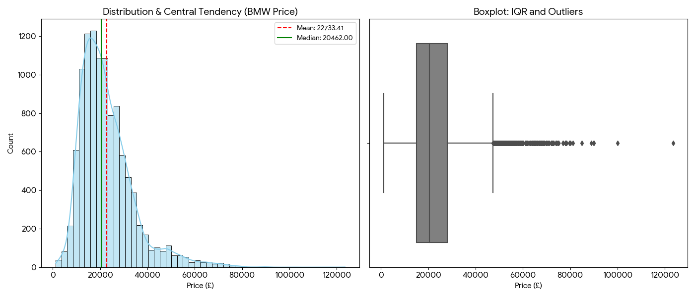

# Statistical Data Analysis

**Author:** Alimuratova Arailym  
**GitHub Repository:** [Center-and-Variability-of-BMW-price](https://github.com/bejbaryszappar790-jpg/Center-and-Variability-of-BMW-price)

---

## 1. Dataset Overview

The analysis was conducted on a dataset containing secondary market records for BMW vehicles (`bmw.csv`). The specific variable analyzed is **`price`** (Vehicle Price in £), which captures real-world market valuation data, including luxury models that act as high-value extreme anomalies.

---

## 2. Descriptive Statistics & Formulas

Based on the analysis of the `price` variable, the following central tendency and variability metrics were calculated:

| Metric | Value | Mathematical Formula |
| :--- | :---: | :--- |
| **Sample Size ($N$)** | `10,781` | $N$ |
| **Mean** | `£22,733.41` | $\bar{x} = \frac{1}{n} \sum_{i=1}^{n} x_i$ |
| **Median** | `£20,462.00` | $\tilde{x} = \begin{cases} x_{\frac{n+1}{2}} & \text{if } n \text{ is odd} \\ \frac{1}{2} \left( x_{\frac{n}{2}} + x_{\frac{n}{2} + 1} \right) & \text{if } n \text{ is even} \end{cases}$ |
| **Variance** | `130,314,283.83` | $s^2 = \frac{\sum_{i=1}^{n} (x_i - \bar{x})^2}{n - 1}$ |
| **Standard Deviation** | `£11,415.53` | $s = \sqrt{\frac{\sum_{i=1}^{n} (x_i - \bar{x})^2}{n - 1}}$ |
| **Range** | `£122,256.00` | $Range = x_{max} - x_{min}$ *(Max: £123,456 − Min: £1,200)* |
| **Interquartile Range (IQR)** | `£12,990.00` | $IQR = Q_3 - Q_1$ |

---

## 3. Justification for Metrics

* **Central Tendency (Median):**  
  The BMW price data exhibits a pronounced right-skewed distribution due to the presence of high-end luxury and premium sports models (outliers). Because the **Mean** is heavily distorted by these expensive outliers, pulling it higher, the **Median** (`£20,462.00`) was selected as a much more robust estimator that accurately represents the typical price a consumer might expect to pay.

* **Variability (Interquartile Range - IQR):**  
  **Variance** and **Standard Deviation** are highly sensitive to price extremes because they square the deviations from the mean, excessively penalizing large gaps caused by luxury models. The **IQR** (`£12,990.00`) isolates the central 50% of the dataset. This provides a highly stable measure of price dispersion that reflects natural market variability without being skewed by isolated anomalies at the extreme high end.

---

## 4. Visualizations

The charts below illustrate the strong right-skewness of the data and the concentration of outliers in the higher price brackets.

  

